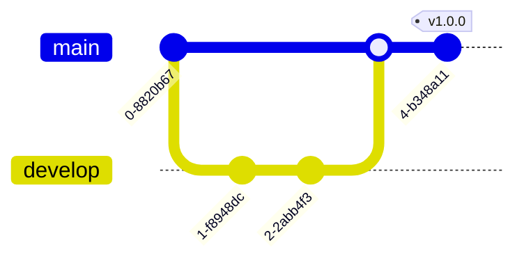

<div id="top" align="center" style="text-align:center;">
<h1>
  <br> 📦 TypeScript Application Template

  [![CodeQL][url-codeql-badge]][url-codeql]
  [![Test][url-test-badge]][url-test]
  ![Coverage][url-coverage-badge]
  [![Release][url-release-badge]][url-release]

  
  
  
  
  [](./LICENSE)
  <a href="https://navto.me/heliomarpm" target="_blank"></a>

</h1>

<div class="badges">

  [![PayPal][url-paypal-badge]][url-paypal]
  [![Ko-fi][url-kofi-badge]][url-kofi]
  [![Liberapay][url-liberapay-badge]][url-liberapay]
  [![GitHub Sponsors][url-github-sponsors-badge]][url-github-sponsors]
  
</div>
</div>

## 📚 Summary

**Professional Template** with automated CI/CD, TypeDoc-generated documentation, and production-ready semantic versioning.

## 🔀 PR Workflow



## 🧩 What's Included

<!-- 🔳☑️ -->

**Core Infrastructure**
- ☑️ Node.js + TypeScript
- ☑️ Vitest (Unit Testing)
- ☑️ Semantic Release
- ☑️ GitHub Actions CI/CD 
- ☑️ GitHub Actions GitHub Pages

**Quality Assurance**
- ☑️ BiomeJS (Linting/Formatting)
- ☑️ Husky + Lint Staged
- ☑️ Commitlint + Conventional Commits
- ☑️ CodeQL Scanning

**Project Scaffolding**
- ☑️ Docs: Contribution Guide & Code of Conduct
- ☑️ Husky Git Hooks
- ☑️ Automated CHANGELOG.md
- ☑️ TypeDoc + Vitepress for Documentation Site

---

## 🤖 Automation Features

Workflow  | Description | Trigger 
 ---  | --- | ---
0.test.yml	| Runs unit tests	| Push/PR to main
1.create_pr.yml	| Creates pull requests	| Push/PR to develop
2.release.yml	| Generates releases	| Successful tests
3.deploy-docs.yml	| Deploys docs	| Successful release

<details>
<summary>Show full workflow</summary>


</details>


### ❓ When to Use This Template

Perfect for developers who need:

1. **Zero-config** TypeScript library setup
2. **Automated docs** with TypeDoc
3. **CI/CD pipeline** with GitHub Actions
4. **Semantic versioning** right out of the box

### 💡 Ideal for:

- Building npm packages
- Open source projects
- Enterprise-grade libraries

---
## 🚀 Quick Start

```bash
npx degit heliomarpm/tsapp-template your-app
cd your-app
npm install
```
## ⚙️ Configuration Guide

### Workflow permissions

You'll need to update the workflow permissions in your repository.

- Access the repository's `Settings` section
- Access Actions in the side menu
- Check the `Read and write permissions` option and `Allow GitHub Actions to create and approve pull requests`

### Documentation Page

see [TypeDoc Vitepress](https://www.typedoc-plugin-markdown.org/plugins/vitepress/quick-start)

- First time: `npx vitepress init` 
- Documentation code base: `npm run docs` or `npm run docs:dev`	

### Dry Run Releasing

Test releasing without version bump:

```bash
npm run release:test
# or 
npx semantic-release --dry-run
```

### Requirements

| Requirement | Description |
| - | - |
Branch protection |	Require PR reviews before merge

## 📑 Access Token (PAT) Configuration for Semantic Release

In order for Semantic Release to perform `git push` on the protected branch (`main`), it is necessary to use a **Personal Access Token (PAT)** with appropriate permissions.

Below are the recommended options and their implications:

### 🔐 Option 1 — Classic Personal Access Token (PAT)

✅ **Required permissions:**

- `repo` (for read and write access to repositories)
- `workflow` (for interacting with GitHub Actions)

✅ **Features:**

- A single token can be used in **any repository of the same user or organization**
- Cannot restrict granular access to specific repositories or permissions (full access within the configured scope)

✅ **How to use:**

1. Create a Classic PAT in:  
    `GitHub Settings → Developer Settings → Personal access tokens → Tokens (classic)`

1. Enable the scopes:
   - `repo`
   - `workflow`

2. Save the token as a secret in the repository:

   - `Settings → Secrets and variables → Actions`
   - Suggested name: `PAT_TOKEN`

3. Reference in workflow:

```yaml
env:
  GITHUB_TOKEN: ${{ secrets.PAT_TOKEN }}
```

### 🔐 Option 2 — Fine-grained Personal Access Token (PAT)

✅ **Required permissions:**

- `Actions: Read and write`
- `Contents: Read and write`
- `Metadata: Read-only`
- (Optional) `Bypass branch protections` if you want to allow direct push even on protected branches

✅ **Features:**

- Allows you to restrict access to specific repositories at the time of creation
- Controls permissions with more granularity and security
- Needs to explicitly mark which repositories it will have access to
- Can be used in multiple repositories **if configured to allow access to those repositories during token creation** (either by selecting "All repositories" or manually selecting multiple)


✅ **How to use:**

1. Create a Fine-grained PAT in:
    `GitHub Settings → Developer Settings → Personal access tokens → Fine-grained tokens`

2. Set:
   - Repositories: select all required or check “All repositories”
   - Permissions:
     - `Contents: Read and write`
     - `Actions: Read and write`
     - `Metadata: Read-only`
     - (Optional) `Bypass branch protections`

3. Save the token as a secret in the repository:
   - `Settings → Secrets and variables → Actions`
   - Suggested name: `PAT_TOKEN`

4. Reference in workflow:
```yaml
env:
  GITHUB_TOKEN: ${{ secrets.PAT_TOKEN }}
```


> [!NOTE] 
> The token must replace the default GITHUB_TOKEN from GitHub Actions (which respects branch protection rules) so that Semantic Release can git push and create tags/releases.
> 
> The use of PAT is recommended only for controlled workflows, as Classic PAT grants full access within the defined scope.

---
## 📦 Dependencies

✅ Zero runtime dependencies \
🔄 All devDependencies are pinned to latest stable versions


## 🤝 Contributing

We welcome contributions! Please read:

- [Code of Conduct](docs/CODE_OF_CONDUCT.md)
- [Contributing Guide](docs/CONTRIBUTING.md)

Thank you to everyone who has already contributed to the project!

<a href="https://github.com/heliomarpm/tsapp-template/graphs/contributors" target="_blank">
  
</a>

###### Made with [contrib.rocks](https://contrib.rocks).

### ❤️ Support this project

If this project helped you in any way, there are several ways to contribute. \
Help us maintain and improve this template:

⭐ Starring the repository \
🐞 Reporting bugs \
💡 Suggest features \
🧾 Improving the documentation \
📢 Share with others

💰 Supporting via GitHub Sponsors, Ko-fi, Paypal, LiberaPay 

<div class="badges">

  [![PayPal][url-paypal-badge]][url-paypal]
  [![Ko-fi][url-kofi-badge]][url-kofi]
  [![Liberapay][url-liberapay-badge]][url-liberapay]
  [![GitHub Sponsors][url-github-sponsors-badge]][url-github-sponsors]

</div>

## 📝 License

[MIT © Heliomar P. Marques](LICENSE)  <a href="#top">🔝</a>

----
<!-- Sponsor badges -->
[url-paypal-badge]: https://img.shields.io/badge/donate%20on-paypal-1C1E26?style=for-the-badge&labelColor=1C1E26&color=0475fe
[url-paypal]: https://bit.ly/paypal-sponsor-heliomarpm

[url-kofi-badge]: https://img.shields.io/badge/kofi-1C1E26?style=for-the-badge&labelColor=1C1E26&color=ff5f5f
[url-kofi]: https://ko-fi.com/heliomarpm

[url-liberapay-badge]: https://img.shields.io/badge/liberapay-1C1E26?style=for-the-badge&labelColor=1C1E26&color=f6c915
[url-liberapay]: https://liberapay.com/heliomarpm

[url-github-sponsors-badge]: https://img.shields.io/badge/GitHub%20-Sponsor-1C1E26?style=for-the-badge&labelColor=1C1E26&color=db61a2
[url-github-sponsors]: https://github.com/sponsors/heliomarpm

<!-- GitHub Actions badges -->
[url-test-badge]: https://github.com/heliomarpm/tsapp-template/actions/workflows/0.test.yml/badge.svg
[url-test]: https://github.com/heliomarpm/tsapp-template/actions/workflows/0.test.yml
[url-coverage-badge]: https://img.shields.io/badge/coverage-dynamic.svg?label=coverage&color=informational&style=flat&logo=jest&query=$.coverage&url=https://heliomarpm.github.io/tsapp-template/coverage-badge.json

<!-- https://img.shields.io/endpoint?url=https://heliomarpm.github.io/tsapp-template/coverage-badge.json&label=coverage&suffix=%25 -->

[url-release-badge]: https://github.com/heliomarpm/tsapp-template/actions/workflows/2.release.yml/badge.svg
[url-release]: https://github.com/heliomarpm/tsapp-template/actions/workflows/2.release.yml

[url-codeql-badge]: https://github.com/heliomarpm/tsapp-template/actions/workflows/codeql.yml/badge.svg 
[url-codeql]: https://github.com/heliomarpm/tsapp-template/security/code-scanning
